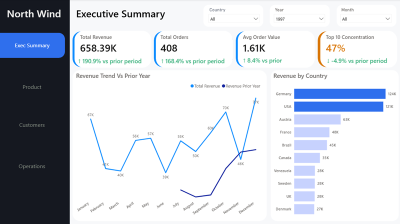
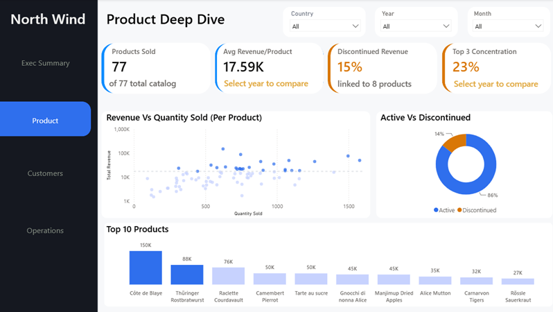
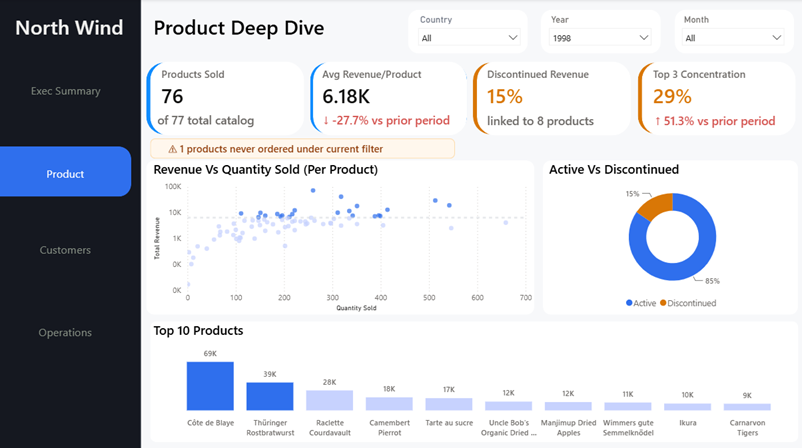
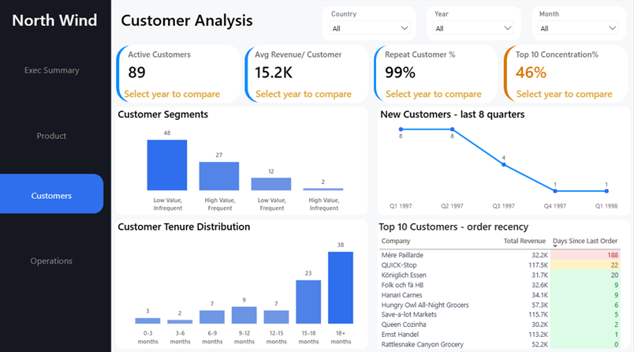
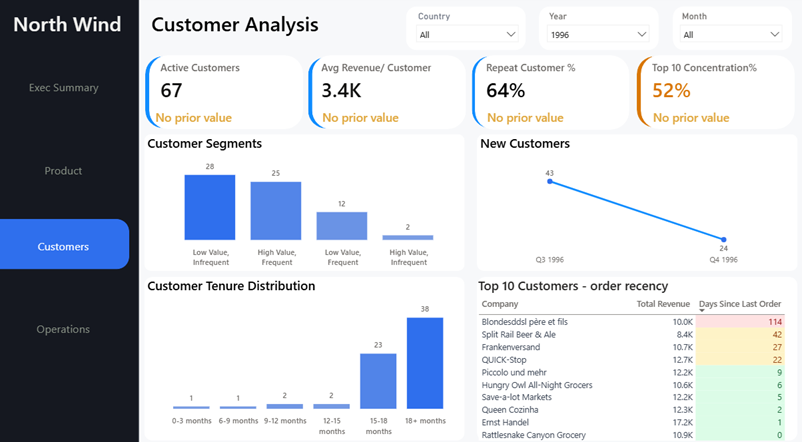
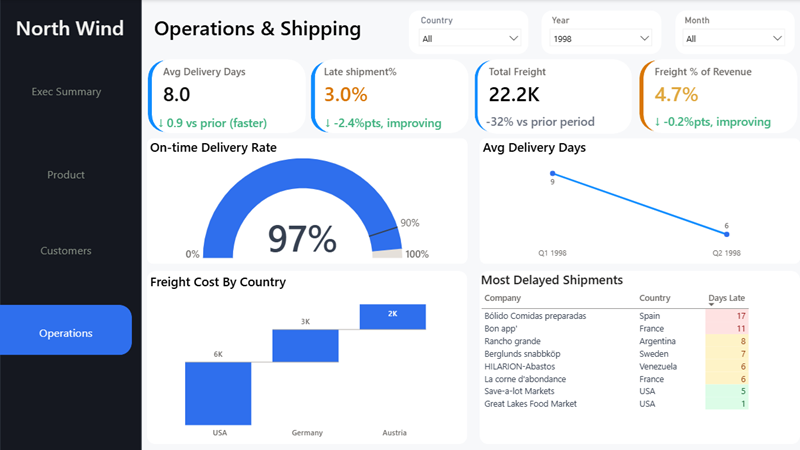

# Northwind Sales Intelligence Dashboard
A 4-page Power BI dashboard built on the Northwind sample database, covering revenue, product performance, customer behavior, and shipping operations. Every KPI card compares against the same period last year, and every time-based chart is capped so it doesn't turn into a mess once more data gets added.

## Page 1: Executive Summary

This is the "how's the business doing" page. Four cards up top: Total Revenue (1.35M), Total Orders (830), Avg Order Value (1.63K), and Top 10 Concentration (46%), each with a year-over-year comparison underneath. Below that, a trend line comparing this year's monthly revenue against last year's, and a bar chart breaking revenue down by country. USA and Germany are neck and neck at the top, pulling in 264K and 245K.

## Page 2: Product Deep Dive

Here's where I dug into the 77-product catalog. Products Sold, Avg Revenue per Product, Discontinued Revenue %, and Top 3 Concentration sit up top. The big one is a scatter chart plotting revenue against quantity sold for every product, so you can see at a glance which ones are high-price-low-volume versus the other way around. There's also a donut showing active versus discontinued stock, a Top 10 products bar chart, and a small warning banner that only shows up when products in the catalog haven't sold anything under the current filter.

## Page 3: Customer Analysis

Active Customers, Avg Revenue per Customer, Repeat Customer %, and Top 10 Concentration up top. I split customers into four segments (high value/frequent, low value/infrequent, etc.) based on where they land relative to the averages, a tenure distribution showing how long customers stick around, a trend of new customers gained per quarter, and a table ranking the top 10 customers by how long it's been since their last order. That last one's genuinely useful. A couple of your biggest accounts by revenue haven't ordered in months, and that's the kind of thing that gets buried in a spreadsheet but jumps out here.

## Page 4: Operations & Shipping

 Avg Delivery Days, Late Shipment %, Total Freight, and Freight as a % of Revenue. A gauge shows on-time delivery rate against a 90% target, a waterfall chart breaks down freight cost by country, there's a bounded 8-quarter trend of delivery speed, and a table listing the most delayed shipments with the exact number of days late.

### Few Technical Notes
Every KPI's year-over-year delta had to account for what happens when there's no prior year to compare against, since 1996 is the first year in the dataset. I also ran into a subtle bug where DAX subtraction treats a blank as zero instead of staying blank, which made deltas look real even when there was no prior-year data at all. Took a while to track down.
Any chart built on time (quarters, months) uses a Top N filter capped to a fixed window, so the layout doesn't fall apart as more years of data get added. Same idea applies to the customer segments and tenure charts. They're always the same number of categories no matter how many customers you throw at them.
